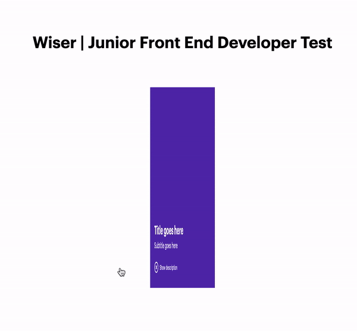

# Wiser | Junior Front End Developer Test

## Instructions

You need to run commands `npm install` and then `npm run dev` in order to run the project on you local development server.

# Description

React App Test
The component design is split into two states. Each time the icon/button is clicked, the component toggles between states one and two.
The component is responsive for desktop and mobile devices.
The component is cross-browser compatible, the latest versions of Safari, Firefox and Chrome is fine.

# Demo 

